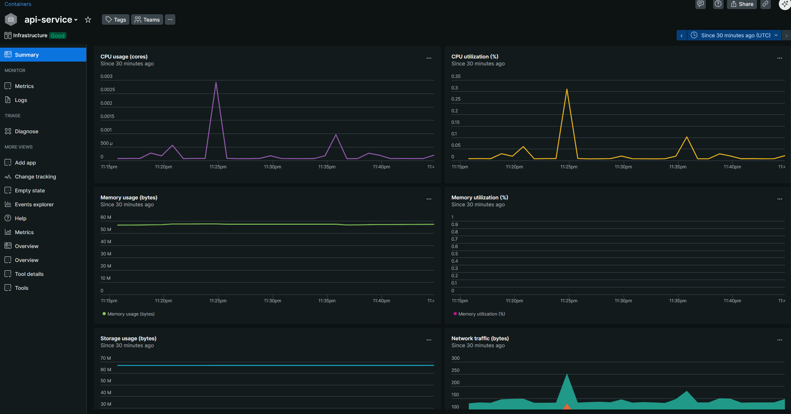
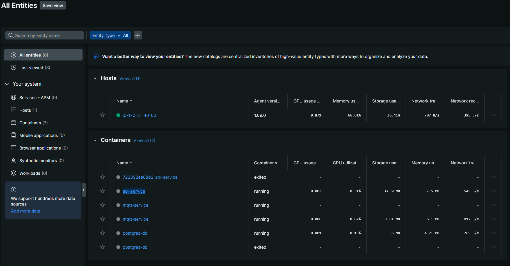
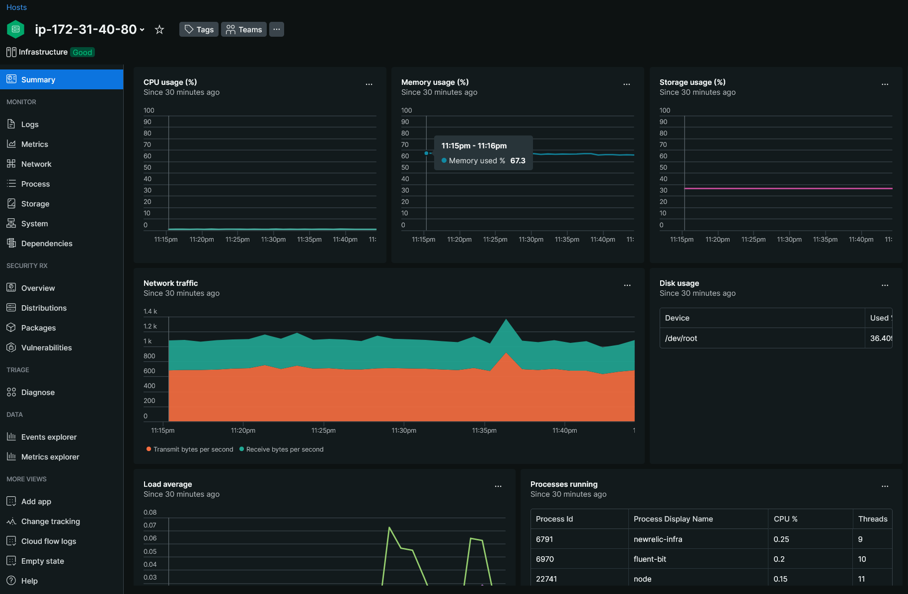

# Monitoreo con NewRelic

## Instalación

* Conectarse a la instancia EC2 a través de ssh
* Crearse una cuenta de NewRelic y seleccionar nueva integración con Linux
* Obtener LICENSE_KEY y ejecutar ````echo "license_key: YOUR_LICENSE_KEY" | sudo tee -a /etc/newrelic-infra.yml````
* Agregar clave GPG ````curl -fsSL https://download.newrelic.com/infrastructure_agent/gpg/newrelic-infra.gpg | sudo gpg --dearmor -o /etc/apt/trusted.gpg.d/newrelic-infra.gpg````
* Agregar repositorio del agente. Para Ubuntu 22.04 ejecutar ````echo "deb https://download.newrelic.com/infrastructure_agent/linux/apt/ jammy main" | sudo tee -a /etc/apt/sources.list.d/newrelic-infra.list````
* Actualizar repositorios con ````sudo apt-get update````
* Instalar agente con ```sudo apt-get install newrelic-infra -y```
* Verificar instalación con ````sudo systemctl status newrelic-infra```` y revisar métricas en portal.

* Agregar variables al archivo **.env**
````
NEW_RELIC_API_KEY=YOUR_NEW_RELIC_API_KEY
NEW_RELIC_ACCOUNT_ID=YOUR_ACCOUNT_ID
NEW_RELIC_LOG_LEVEL=info

````
* Crear archivo configuración **newrelic.js** dentro de la api que contenga
````
exports.config = {
  app_name: ['Proyecto-Arqui-Backend'],
  license_key: process.env.NEW_RELIC_API_KEY,
  logging: {
    level: process.env.NEW_RELIC_LOG_LEVEL || 'info',
  },
};
````
* Al incicio de **index.js**, importar NewRelic con ``require('newrelic');`` en la primera línea.
* Deberían salir ahora en NewRelic las métricas para los contenedores.
## Capturas




